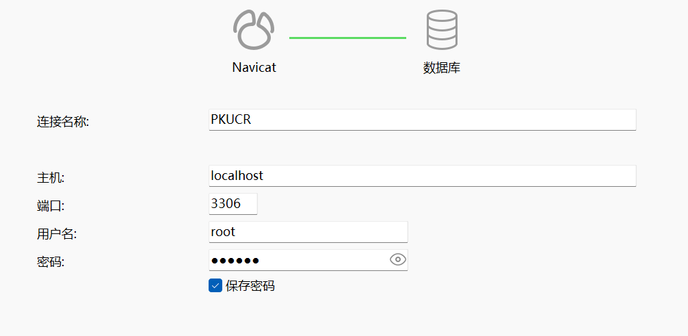
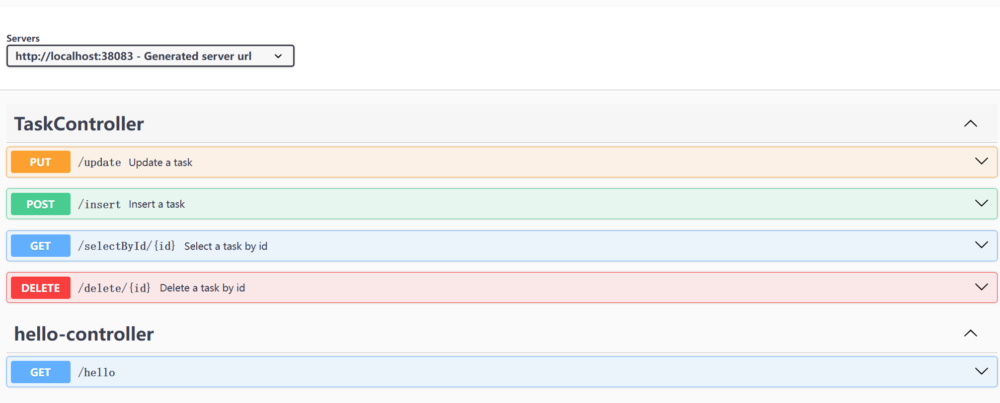

# Backend of PKUCR Project

## 项目结构

前后端之间通过RESTful API进行通信，前端通过HTTP请求与后端进行交互。传递JSON数据。

前端使用前端的服务器(Nginx)，后端使用后端的服务器(Tomcat)。

后端在PKUCRProject.PKUCR.backend下加包。

后端的结构是这样的：
```
src/main/java/PKUCRProject/PKUCR/backend
├── Auth
│   ├── CustomAuthenticationProvider.java
│   └── JwtAuthenticationFilter.java
├── Config
│   └── SecurityConfig.java
├── Controller
│   ├── CorsController.java
│   ├── CourseController.java
│   ├── HelloController.java
│   ├── TasksController.java
│   └── UserController.java
├── Dao
│   ├── CourseMapper.java
│   ├── TaskMapper.java
│   └── UserMapper.java
├── Entity
│   ├── Course.java
│   ├── Task.java
│   ├── User.java
│   ├── LoginRequest.java
│   └── TokenResponse.java
├── Service
│   ├── CourseService.java
│   ├── TaskService.java
│   └── CustomUserDetailsService.java
└── Utils
    ├── Claims.java
    ├── JwtUtils.java
    └── DateUtils.java
```

## 使用说明

使用Gradle构建项目。

请先替换Gradle的源为阿里云：在`gradle/wrapper/gradle-wrapper.properties`中修改`distributionUrl`为`https://mirrors.aliyun.com/macports/distfiles/gradle/gradle-8.10.2-bin.zip`。

ps: 我电脑上有若干种版本的java. 请注意使用正确的java版本. 如果vscode里面可以在
`.vscode/settings.json`中加入`"java.import.gradle.java.home": "..."`, 不然似乎总是会报错.

然后使用下面的命令构建项目：
```shell
./gradlew bootRun
```
或者
```shell
.\gradlew.bat bootRun
```

应该可以看到下面的结果：
```shell
PS YourProjectDirectory\backend> ./gradlew bootRun

> Task :bootRun

  .   ____          _            __ _ _
 /\\ / ___'_ __ _ _(_)_ __  __ _ \ \ \ \
( ( )\___ | '_ | '_| | '_ \/ _` | \ \ \ \
 \\/  ___)| |_)| | | | | || (_| |  ) ) ) )
  '  |____| .__|_| |_|_| |_\__, | / / / /
 =========|_|==============|___/=/_/_/_/

 :: Spring Boot ::                (v3.3.4)

2024-10-18T08:54:38.783+08:00  INFO 6744 --- [backend] [           main] P.PKUCR.backend.DemoApplication          : Starting DemoApplication using Java 23.0.1 with PID 6744 (YourProjectDirectory\backend\build\classes\java\main started by User in YourProjectDirectory\backend)
2024-10-18T08:54:38.785+08:00  INFO 6744 --- [backend] [           main] P.PKUCR.backend.DemoApplication          : No active profile set, falling back to 1 default profile: "default"
2024-10-18T08:54:39.454+08:00  INFO 6744 --- [backend] [           main] o.s.b.w.embedded.tomcat.TomcatWebServer  : Tomcat initialized with port 8080 (http)
2024-10-18T08:54:39.468+08:00  INFO 6744 --- [backend] [           main] o.apache.catalina.core.StandardService   : Starting service [Tomcat]
2024-10-18T08:54:39.469+08:00  INFO 6744 --- [backend] [           main] o.apache.catalina.core.StandardEngine    : Starting Servlet engine: [Apache Tomcat/10.1.30]
2024-10-18T08:54:39.516+08:00  INFO 6744 --- [backend] [           main] o.a.c.c.C.[Tomcat].[localhost].[/]       : Initializing Spring embedded WebApplicationContext
2024-10-18T08:54:39.517+08:00  INFO 6744 --- [backend] [           main] w.s.c.ServletWebServerApplicationContext : Root WebApplicationContext: initialization completed in 673 ms
2024-10-18T08:54:39.759+08:00  INFO 6744 --- [backend] [           main] o.s.b.w.embedded.tomcat.TomcatWebServer  : Tomcat started on port 8080 (http) with context path '/'
2024-10-18T08:54:39.765+08:00  INFO 6744 --- [backend] [           main] P.PKUCR.backend.DemoApplication          : Started DemoApplication in 1.298 seconds (process running for 1.643)
2024-10-18T08:54:53.923+08:00  INFO 6744 --- [backend] [nio-8080-exec-1] o.a.c.c.C.[Tomcat].[localhost].[/]       : Initializing Spring DispatcherServlet 'dispatcherSerst].[/]       : Initializing Spring DispatcherServlet 'dispatcherServlet'
2024-10-18T08:54:53.923+08:00  INFO 6744 --- [backend] [nio-8080-exec-1] o.s.web.servlet.DispatcherServlet        : Initializing Servlet 'dispatcherServlet'
2024-10-18T08:54:53.924+08:00  INFO 6744 --- [backend] [nio-8080-exec-1] o.s.web.servlet.DispatcherServlet        : Completed initialization in 1 ms
<==========---> 80% EXECUTING [1m 17s]
> :bootRun
```

随后在浏览器中输入`http://localhost:38083/hello`，应该可以看到后端的主页。


## MySQL配置说明

首先安装`https://dev.mysql.com/downloads/installer/`。
注意可以选择只安装`MySQL Server 8.0.40 - X64`。点击这个之后，应该可以看到`Advanced Options`，注意这里可以更改安装路径。之后一路狂点即可。记得设置环境变量。（我把服务的名称改成了`MySQL`而不是`MySQL80`，这样比较方便一点。）

可以修改时区为东八区：先找到 `my.ini` ，然后在 `[mysqld]` 下添加 `default-time-zone='+08:00'` 。最后重启 `MySQL` 服务。

登录使用
```shell
mysql -uroot -p
```

之后会要求你输入刚才设置的密码，接着显示如下页面：
```shell
PS YourDirectory> mysql -uroot -p
Enter password: ******
Welcome to the MySQL monitor.  Commands end with ; or \g.
Your MySQL connection id is 14
Server version: 8.0.40 MySQL Community Server - GPL

Copyright (c) 2000, 2024, Oracle and/or its affiliates.

Oracle is a registered trademark of Oracle Corporation and/or its
affiliates. Other names may be trademarks of their respective
owners.

Type 'help;' or '\h' for help. Type '\c' to clear the current input statement.

mysql>
```

接着我们使用 `Navicat Premium` 来创建连接。


接下来我们继续在 `application.properties` 中配置数据库连接。
```properties
spring.datasource.url=jdbc:mysql://localhost:3306/pkucr_database
spring.datasource.username=root
spring.datasource.password=******
spring.datasource.driver-class-name=com.mysql.cj.jdbc.Driver
```
## 依赖说明

```gradle
dependencies {
	implementation 'org.mybatis.spring.boot:mybatis-spring-boot-starter:3.0.3'
	implementation 'org.springdoc:springdoc-openapi-starter-webmvc-ui:2.6.0'
	runtimeOnly 'com.mysql:mysql-connector-j'
	implementation 'org.springframework.boot:spring-boot-starter-web'
	testImplementation 'org.springframework.boot:spring-boot-starter-test'
	testImplementation 'org.mybatis.spring.boot:mybatis-spring-boot-starter-test:3.0.3'
	testRuntimeOnly 'org.junit.platform:junit-platform-launcher'
}
```

我们使用了`MyBatis`作为持久层框架，`SpringDoc`作为API文档生成工具，`MySQL`作为数据库。这里面的`@Api...`注解都来自于`Swagger`.

注意 `SpringFox` 和 `SpringBoot 3.x` 似乎不兼容。

## 简单的API文档说明

在`http://localhost:38083/swagger-ui.html`中可以看到API文档。并且可以进行简单的测试。



## token

使用基于 Token 的身份验证方法，在服务端不需要存储用户的登录记录。流程是这样的：

1、客户端使用用户名跟密码请求登录

2、服务端收到请求，去验证用户名与密码 ，验证成功后，服务端会签发一个 Token，再把这个 Token 发送给客户端

3、客户端收到 Token 以后可以把它存储起来，比如放在 Cookie 里或者 Local Storage 里

4、客户端每次向服务端请求资源的时候需要带着服务端签发的 Token

5、服务端收到请求，然后去验证客户端请求里面带着的 Token，如果验证成功，就向客户端返回请求的数据

APP登录的时候发送加密的用户名和密码到服务器，服务器验证用户名和密码，如果成功，以某种方式比如随机生成32位的字符串作为token，存储到服务器中，并返回token到APP，以后APP请求时，

凡是需要验证的地方都要带上该token，然后服务器端验证token，成功返回所需要的结果，失败返回错误信息，让他重新登录。其中服务器上token设置一个有效期，每次APP请求的时候都验证token和有效期。

我们使用`nimbus-jose-jwt`来实现token.

TODO: 为了安全，我们应该使用`https`来传输token。

```json
{
  "email": "pikachu@126.com",
  "password": "123456"
}
```

## 测试

使用`Postman`进行测试。